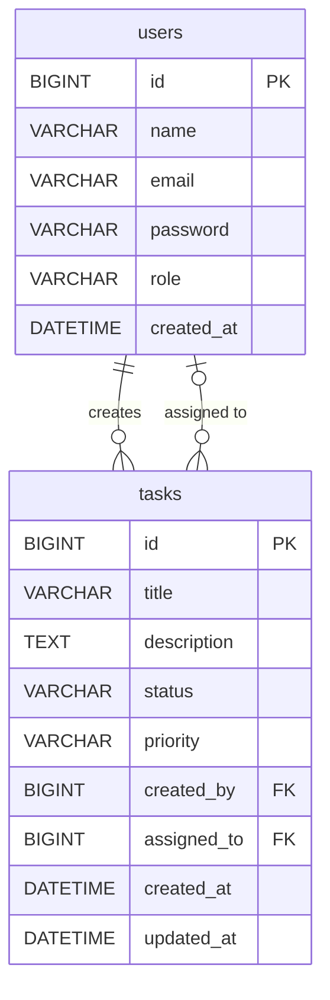

# TaskFlow — Task Management System

A full-stack task management app where users manage their own tasks and admins have full control.

Demo - https://drive.google.com/file/d/14g84Pfyh-3CRndfpirhPctrOw7z2BhOs/view?usp=sharing

---

## Table of Contents

- [Tech Stack](#tech-stack)
- [Project Structure](#project-structure)
- [Roles and Access](#roles-and-access)
- [Database Design](#database-design)
- [API Reference](#api-reference)
- [Frontend Pages](#frontend-pages)
- [Sample Users](#sample-users)
- [How to Run](#how-to-run)
- [Environment Variables](#environment-variables)
- [CI/CD](#cicd)
- [Learnings](#learnings)
- [Known Limitations](#known-limitations)

---

## Tech Stack

| Layer | Technology |
|---|---|
| Frontend | React 19, React Router v7 |
| UI | Bootstrap 5 |
| HTTP | Axios |
| Forms | Formik, Yup |
| Backend | Spring Boot 3, Spring Security, Spring Data JPA, Hibernate |
| Auth | JWT via JJWT, BCrypt |
| Database | MySQL 8 |
| DevOps | Docker, Docker Compose, GitHub Actions CI |
| Dev Tools | Lombok, Spring DevTools |

---

## Project Structure

```
task-management-main/
├── .github/workflows/ci.yml
├── taskmanager-backend/
│   ├── src/main/java/com/tasksystemnidharshana/taskmanager/
│   │   ├── config/SecurityConfig.java
│   │   ├── controller/AuthController.java, TaskController.java, UserController.java
│   │   ├── entity/User.java, Task.java
│   │   ├── exception/GlobalExceptionHandler.java, ResourceNotFoundException.java, TaskApiException.java
│   │   ├── payload/LoginDto, RegisterDto, TaskDto, TaskResponseDto, UserResponseDto, JwtAuthResponse, PagedTaskResponse
│   │   ├── repository/TaskRepository.java, UserRepository.java
│   │   ├── security/JwtTokenProvider, JwtAuthenticationFilter, CustomUserDetailsService
│   │   └── service/impl/AuthServiceImpl, TaskServiceImpl, UserServiceImpl
│   ├── Dockerfile
│   └── pom.xml
├── taskmanager-frontend/
│   ├── src/
│   │   ├── api/axios.js
│   │   ├── components/Navbar/
│   │   └── pages/LoginPage, RegisterPage, DashboardPage, TaskFormPage, UserManagementPage, ErrorPage
│   ├── Dockerfile
│   └── package.json
└── docker-compose.yml
```

---

## Roles and Access

There are two roles: `ADMIN` and `USER`. Everyone who registers is automatically a `USER`. There is no way to self-assign `ADMIN`.

To promote a user to admin, run this SQL directly:

```sql
UPDATE users SET role = 'ADMIN' WHERE email = 'user@example.com';
```

### As a User — testing flow

Register and log in. Create a task — you are always assigned to it yourself. On the dashboard, you can only see tasks you created or tasks that were assigned to you by an admin. You can filter those by status or priority, or search by keyword. You can update any task you created or are assigned to, but you cannot change who it is assigned to. You cannot delete tasks — you will get a 403. 

### As an Admin — testing flow

Register a user, promote them to admin via SQL, then log in. Create a task and assign it to any registered user. On the dashboard, you can see all tasks in the system. Filter by status, priority, assigned user, or search by keyword. Update any task and reassign it to a different user. Delete any task. Visit /users to see the full list of registered users.

---

## Database Design

**users**

| Column | Type | Notes |
|---|---|---|
| id | BIGINT | Primary key, auto increment |
| name | VARCHAR | Not null |
| email | VARCHAR | Unique, not null |
| password | VARCHAR | BCrypt hashed |
| role | VARCHAR | ADMIN or USER |
| created_at | DATETIME | Set on insert |

**tasks**

| Column | Type | Notes |
|---|---|---|
| id | BIGINT | Primary key, auto increment |
| title | VARCHAR | Not null |
| description | TEXT | Optional |
| status | VARCHAR | TODO, IN_PROGRESS, or DONE — defaults to TODO |
| priority | VARCHAR | HIGH, MEDIUM, or LOW — defaults to MEDIUM |
| created_by | BIGINT | Foreign key → users.id |
| assigned_to | BIGINT | Foreign key → users.id, nullable |
| created_at | DATETIME | Set on insert |
| updated_at | DATETIME | Updated on every change |



---

## API Reference

Base URL: `http://localhost:8080`

Protected endpoints require: `Authorization: Bearer <token>`

### Anyone

| Method | Endpoint | What it does |
|---|---|---|
| POST | /api/auth/register | Register a new account. Role is always set to USER. |
| POST | /api/auth/login | Login. Returns accessToken, tokenType, and role. |

### Admin only

| Method | Endpoint | What it does |
|---|---|---|
| GET | /api/users | Get all registered users. |
| GET | /api/users/{id} | Get one user by ID. |
| DELETE | /api/tasks/{id} | Delete a task. Returns 403 if called by a User. |

### User

| Method | Endpoint | What it does |
|---|---|---|
| POST | /api/tasks | Create a task. Always assigned to themselves. |
| GET | /api/tasks | Get tasks they created or are assigned to. Supports filters. |
| GET | /api/tasks/{id} | Get one task by ID. |
| PUT | /api/tasks/{id} | Update a task they created or are assigned to. Cannot change assignedToId. Returns 403 if they do not own it. |

### Admin

| Method | Endpoint | What it does |
|---|---|---|
| POST | /api/tasks | Create a task. Can assign to any user via assignedToId. |
| GET | /api/tasks | Get all tasks in the system. Supports filters including assignedTo. |
| GET | /api/tasks/{id} | Get one task by ID. |
| PUT | /api/tasks/{id} | Update any task. Can reassign via assignedToId. |

### GET /api/tasks — optional filters

All parameters are optional. Results are always sorted newest first.

| Parameter | Accepted values | Who can use it |
|---|---|---|
| status | TODO, IN_PROGRESS, DONE | User, Admin |
| priority | HIGH, MEDIUM, LOW | User, Admin |
| search | any text | User, Admin — searches title and description |
| assignedTo | user ID | Admin only — ignored for regular users |
| page | 0, 1, 2... | User, Admin — default is 0 |
| size | any number | User, Admin — default is 6 |

### Error responses

| Status | When it happens |
|---|---|
| 400 | Missing required field, invalid status or priority value, or email already registered |
| 401 | No token, or token is expired or invalid |
| 403 | Logged in but not allowed — user trying to delete a task or access /api/users, or update a task they do not own |
| 404 | Task or user with that ID does not exist |
| 500 | Unexpected server error |

---

## Frontend Pages

| Page | Route | Who can access |
|---|---|---|
| Login | /login | Public |
| Register | /register | Public |
| Dashboard | /dashboard | All logged-in users |
| Create Task | /tasks/new | All logged-in users |
| Edit Task | /tasks/edit/:id | Creator, assignee, or Admin |
| User Management | /users | Admin only — others are redirected to dashboard |
| Error | * | Catch-all for unknown routes |

---

## Sample Users

### Admin

Register a normal user first, then promote via SQL:

```json
{
  "name": "demo",
  "email": "demo@taskflow.com",
  "password": "demo123"
}
```

```sql
UPDATE users SET role = 'ADMIN' WHERE email = 'demo@taskflow.com';
```

### Regular User

Register through the app at `/register` or POST to `/api/auth/register`:

```json
{
  "name": "Your Name",
  "email": "you@example.com",
  "password": "yourpassword"
}
```

---

## How to Run

Requirements: Docker Desktop installed and running.

```bash
git clone https://github.com/Nidhee3/task-management.git
cd task-management-main
```

Build the backend jar first:

```bash
cd taskmanager-backend
./mvnw clean package -DskipTests
cd ..
```

Create a `.env` file in the project root, then:

```bash
docker compose up --build
```

| Service | URL |
|---|---|
| Frontend | http://localhost:3000 |
| Backend API | http://localhost:8080 |

To stop: `docker compose down`
To stop and delete the database volume: `docker compose down -v`

---

## Environment Variables

```env
MYSQL_ROOT_PASSWORD=yourpassword
APP_JWT_SECRET=your-base64-encoded-secret
```

| Variable | Used by | Description |
|---|---|---|
| MYSQL_ROOT_PASSWORD | Database, Backend | MySQL root password |
| APP_JWT_SECRET | Backend | Base64-encoded secret to sign JWT tokens |

---

## CI/CD

Pipeline file: `.github/workflows/ci.yml`

1. Check out the code
2. Set up Java 21 — build backend with `mvn clean package -DskipTests`
3. Set up Node 20 — build frontend with `npm ci && npm run build`
4. Build both Docker images

---

## Learnings

**JWT from scratch** — Building the full JWT flow end to end was new to me. Generating the token on login, signing it, validating it on every request, and loading the user from the database — all learnt and built during this project.

**Pagination** — The backend should fetch only the data needed for the current page rather than pulling everything at once.

**Lombok** — Using `@Data`, `@AllArgsConstructor`, and `@NoArgsConstructor` across entity and DTO classes saved a lot of time and kept files small and readable.

---

## Known Limitations

- Admin can view users but cannot deactivate or delete them. No DELETE or PATCH endpoint for users.
- No Swagger/OpenAPI — all endpoints are documented in this README.
- No JWT refresh — tokens expire after 24 hours and the user must log in again.
  
I learnt a lot of new concepts, practised what I learnt and what I knew already and applied them through this project.
