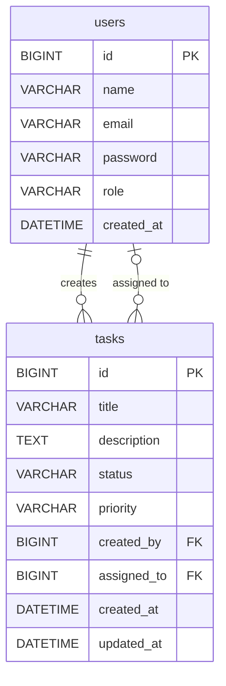

# TaskFlow — Task Management System

A full-stack task management where users can create and manage their own tasks. Admins have full control over all tasks and can view all registered users.

---

## Table of Contents

- [Tech Stack](#tech-stack)
- [Project Structure](#project-structure)
- [Database Design](#database-design)
- [Application Architecture](#application-architecture)
- [User Roles and Permissions](#user-roles-and-permissions)
- [API Reference](#api-reference)
- [Frontend Pages](#frontend-pages)
- [What I Implemented](#what-i-implemented)
- [Sample Users](#sample-users)
- [How to Run](#how-to-run)
- [Environment Variables](#environment-variables)
- [CI/CD](#cicd)
- [Learnings](#learnings)
- [Known Limitations](#known-limitations)

---

## Tech Stack

| Layer | Technology | Notes |
|---|---|---|
| Frontend | React 19, React Router v7 | Created with Create React App |
| UI | Bootstrap 5 | Used instead of Tailwind CSS |
| HTTP | Axios | For all API calls |
| Forms | Formik, Yup | Form state and frontend validation |
| Backend | Spring Boot 3, Spring Security, Spring Data JPA, Hibernate | REST API |
| Auth | JWT via JJWT, BCrypt | Token-based auth, hashed passwords |
| Database | MySQL 8 | |
| DevOps | Docker, Docker Compose, GitHub Actions CI | |
| Dev Tools | Lombok, Spring DevTools | |

---

## Project Structure
```
task-management-main/
├── .github/
│   └── workflows/
│       └── ci.yml
├── taskmanager-backend/
│   ├── src/main/java/com/tasksystemnidharshana/taskmanager/
│   │   ├── config/
│   │   │   └── SecurityConfig.java
│   │   ├── controller/
│   │   │   ├── AuthController.java
│   │   │   ├── TaskController.java
│   │   │   └── UserController.java
│   │   ├── entity/
│   │   │   ├── User.java
│   │   │   └── Task.java
│   │   ├── exception/
│   │   │   ├── GlobalExceptionHandler.java
│   │   │   ├── ResourceNotFoundException.java
│   │   │   └── TaskApiException.java
│   │   ├── payload/
│   │   │   ├── LoginDto.java
│   │   │   ├── RegisterDto.java
│   │   │   ├── TaskDto.java
│   │   │   ├── TaskResponseDto.java
│   │   │   ├── UserResponseDto.java
│   │   │   ├── JwtAuthResponse.java
│   │   │   └── PagedTaskResponse.java
│   │   ├── repository/
│   │   │   ├── TaskRepository.java
│   │   │   └── UserRepository.java
│   │   ├── security/
│   │   │   ├── JwtTokenProvider.java
│   │   │   ├── JwtAuthenticationFilter.java
│   │   │   └── CustomUserDetailsService.java
│   │   └── service/
│   │       ├── impl/
│   │       │   ├── AuthServiceImpl.java
│   │       │   ├── TaskServiceImpl.java
│   │       │   └── UserServiceImpl.java
│   │       ├── AuthService.java
│   │       ├── TaskService.java
│   │       └── UserService.java
│   ├── Dockerfile
│   └── pom.xml
├── taskmanager-frontend/
│   ├── src/
│   │   ├── api/
│   │   │   └── axios.js
│   │   ├── components/
│   │   │   └── Navbar/
│   │   └── pages/
│   │       ├── LoginPage/
│   │       ├── RegisterPage/
│   │       ├── DashboardPage/
│   │       ├── TaskFormPage/
│   │       ├── UserManagementPage/
│   │       └── ErrorPage/
│   ├── Dockerfile
│   └── package.json
└── docker-compose.yml
```

---

## Database Design

**users**

| Column | Type | Notes |
|---|---|---|
| id | BIGINT | Primary key, auto increment |
| name | VARCHAR | Not null |
| email | VARCHAR | Unique, not null |
| password | VARCHAR | BCrypt hashed |
| role | VARCHAR | `ADMIN` or `USER` |
| created_at | DATETIME | Set automatically on insert |

**tasks**

| Column | Type | Notes |
|---|---|---|
| id | BIGINT | Primary key, auto increment |
| title | VARCHAR | Not null |
| description | TEXT | Optional |
| status | VARCHAR | `TODO`, `IN_PROGRESS`, or `DONE` — defaults to `TODO` |
| priority | VARCHAR | `HIGH`, `MEDIUM`, or `LOW` — defaults to `MEDIUM` |
| created_by | BIGINT | Foreign key → users.id |
| assigned_to | BIGINT | Foreign key → users.id, nullable |
| created_at | DATETIME | Set automatically on insert |
| updated_at | DATETIME | Updated automatically on every change |

One user can create many tasks. One user can be assigned to many tasks. Both are separate foreign key relationships pointing to the same `users` table.


---

## Application Architecture
```
Browser (React SPA)
        |
        |  HTTP/JSON + Authorization: Bearer <token>
        v
+------------------------------------------+
|          Spring Boot Backend             |
|                                          |
|   JwtAuthenticationFilter               |  ← validates token on every request
|           |                             |
|           v                             |
|   REST Controllers                      |  ← handles routes and responses
|           |                             |
|           v                             |
|   Service Layer                         |  ← business logic and role checks
|           |                             |
|           v                             |
|   JPA Repositories                      |  ← database queries with pagination
|           |                             |
+-----------|------------------------------+
            |
            v
       +---------+
       |  MySQL  |
       +---------+
```

---

## User Roles and Permissions

There are two roles: `ADMIN` and `USER`. Everyone who registers through the app is automatically assigned `USER`. There is no way to self-assign `ADMIN` during registration.

To promote a user to admin, update their role directly in the database:
```sql
UPDATE users SET role = 'ADMIN' WHERE email = 'user@example.com';
```

Admin can:
- View all registered users
- View, create, update, and delete any task
- Assign tasks to any user and reassign them later
- Filter tasks by assigned user on the dashboard

User can:
- View only tasks they created or are assigned to
- Create tasks (always assigned to themselves)
- Update tasks they created or are assigned to
- Cannot delete tasks → receives `403`
- Cannot view other users → receives `403`
- Cannot reassign tasks → only admins can change who a task is assigned to

Security rules enforced in `SecurityConfig`:
```
/api/auth/**           →  public
/api/users/**          →  ADMIN only
DELETE /api/tasks/**   →  ADMIN only
all other endpoints    →  any logged-in user
```

Role checks are also enforced at the service layer, so the rules hold regardless of how a request reaches the code.

---

## API Reference

All protected endpoints require the header:
```
Authorization: Bearer <token>
```

All responses use `camelCase` JSON. Errors return a consistent body with `timestamp`, `message`, and `details`. Validation errors return a field-level map like `{ "title": "Title is required" }`.

### Auth — Public

| Method | Endpoint | Description |
|---|---|---|
| POST | `/api/auth/register` | Register a new user — role is always `USER` |
| POST | `/api/auth/login` | Login — returns `accessToken` and `role` |

### Users — Admin only

| Method | Endpoint | Description |
|---|---|---|
| GET | `/api/users` | Get all registered users |
| GET | `/api/users/{id}` | Get one user by ID |

### Tasks — Any logged-in user

| Method | Endpoint | Description |
|---|---|---|
| POST | `/api/tasks` | Create a new task |
| GET | `/api/tasks` | Get tasks — paginated, supports filters |
| GET | `/api/tasks/{id}` | Get one task by ID |
| PUT | `/api/tasks/{id}` | Update a task |
| DELETE | `/api/tasks/{id}` | Delete a task — Admin only |

Query parameters for `GET /api/tasks`:

| Parameter | Accepted values | Notes |
|---|---|---|
| `status` | `TODO`, `IN_PROGRESS`, `DONE` | Filter by status |
| `priority` | `HIGH`, `MEDIUM`, `LOW` | Filter by priority |
| `assignedTo` | user ID | Admin only — filter by assigned user |
| `search` | any text | Searches task title and description |
| `page` | `0`, `1`, `2`... | Page number, starts at 0 |
| `size` | number | Tasks per page — default is 6 |

Sample login request and response:
```json
POST /api/auth/login
{
  "email": "abc@taskflow.com",
  "password": "abc123"
}

// Response 200
{
  "accessToken": "eyJhbGciOiJIUzI1NiJ9...",
  "role": "ADMIN"
}
```

Sample task creation request and response:
```json
POST /api/tasks
{
  "title": "Fix login bug",
  "description": "Users cannot log in",
  "status": "TODO",
  "priority": "HIGH",
  "assignedToId": 2
}

// Response 201
{
  "id": 10,
  "title": "Fix login bug",
  "status": "TODO",
  "priority": "HIGH",
  "createdByName": "Admin",
  "assignedToName": "Jane Doe",
  "createdAt": "2024-01-01T10:00:00",
  "updatedAt": "2024-01-01T10:00:00"
}
```

---

## Frontend Pages

| Page | Route | Who can access |
|---|---|---|
| Login | `/login` | Public |
| Register | `/register` | Public |
| Dashboard | `/dashboard` | All logged-in users |
| Create Task | `/tasks/new` | All logged-in users |
| Edit Task | `/tasks/edit/:id` | Creator, assignee, or Admin |
| User Management | `/users` | Admin only — non-admins are redirected to dashboard |
| Error | `*` | Catch-all for unknown routes |

---

## What I Implemented

- User registration and login with JWT authentication
- BCrypt password hashing
- Role-based access control — `ADMIN` and `USER`
- Full task CRUD (create, read, update, delete)
- Admins can assign tasks to any user; regular users are auto-assigned to themselves
- Admins can reassign tasks; regular users cannot
- Users only see tasks they created or are assigned to
- Filter tasks by status, priority, and assigned user (admin only)
- Free-text search on task title and description
- Pagination — 6 tasks per page with numbered controls
- Form validation on both frontend (Formik + Yup) and backend (Jakarta Bean Validation)
- Global exception handling with consistent error responses
- Admin-only user management page
- Navbar adapts based on role and login state
- Docker Compose setup with MySQL healthcheck
- GitHub Actions CI pipeline

**Login and Registration** — Formik + Yup validation, BCrypt hashed passwords, auto-assigned `USER` role, JWT + role saved to `localStorage` on login.

**JWT Authentication** — `JwtAuthenticationFilter` validates `Authorization: Bearer <token>` on every request. Tokens expire after 24 hours.

**Role-Based Access Control** — Three tiers (`public`, `ADMIN`, authenticated) enforced in `SecurityConfig` and the service layer. Navbar and routes adapt per role.

**Task CRUD** — Admins can create, read, update, delete, and reassign any task. Users can create (auto-assigned to themselves), and edit only their own tasks. Delete is admin-only at the filter level.

**Filters, Search, and Pagination** — Filter by status, priority, and assigned user (admin only). Free-text search across title and description. 6 tasks per page with numbered controls.

**Error Handling** — `404`, `400` (with field-level errors), configured status, and `500` — all returning a consistent `ErrorDetail` payload.

**Input Validation** — `@Valid` + Jakarta Bean Validation on all request bodies. Formik + Yup on the frontend; submit disabled until valid.

**User Management** — Admin-only page listing all users with name, email, role badge, and registration date.

**Docker and CI/CD** — Docker Compose runs MySQL (with healthcheck), backend, and frontend. GitHub Actions builds backend, frontend, and both Docker images on every push to `main`.

---

## Sample Users

### Admin

The admin user cannot be created through the registration form. Register a normal user through the app, then promote them via SQL:
```json
{
  "name": "ABC",
  "email": "abc@taskflow.com",
  "password": "abc123"
}
```
```sql
UPDATE users SET role = 'ADMIN' WHERE email = 'abc@taskflow.com';
```

### Regular User

Register through the app at `/register`, or POST to `/api/auth/register`:
```json
{
  "name": "Your Name",
  "email": "you@example.com",
  "password": "yourpassword"
}
```

All registrations are automatically assigned the `USER` role.

---

## How to Run

Requirements: Docker Desktop installed and running.
```bash
git clone https://github.com/Nidhee3/task-management.git
cd task-management-main
```

Build the backend jar first — the Docker image depends on it:
```bash
cd taskmanager-backend
./mvnw clean package -DskipTests
cd ..
```

Create a `.env` file in the project root (see [Environment Variables](#environment-variables)), then:
```bash
docker compose up --build
```

Wait for all three services to start. The backend is ready when you see `Started TaskmanagerApplication` in the logs.

| Service | URL |
|---|---|
| Frontend | http://localhost:3000 |
| Backend API | http://localhost:8080 |

To stop: `docker compose down`  
To stop and delete the database volume: `docker compose down -v`

---

## Environment Variables

Create a `.env` file in the project root. This file is in `.gitignore` and will not be committed.
```env
MYSQL_ROOT_PASSWORD=yourpassword
APP_JWT_SECRET=your-base64-encoded-secret
```

| Variable | Used by | Description |
|---|---|---|
| `MYSQL_ROOT_PASSWORD` | Database, Backend | MySQL root password used by Docker Compose |
| `APP_JWT_SECRET` | Backend | Base64-encoded secret used to sign JWT tokens |

If `APP_JWT_SECRET` is not set, the backend falls back to a default value hardcoded in `application.properties`.

---

## CI/CD

Pipeline steps:
1. Check out the code
2. Set up Java 21 — build the backend with `mvn clean package -DskipTests`
3. Set up Node 20 — install and build the frontend with `npm ci && npm run build`
4. Build both Docker images to verify the Dockerfiles work end to end

Pipeline file: `.github/workflows/ci.yml`

---

## Learnings

**JWT from scratch** — I had never built the full JWT flow end to end before. Generating the token on login, signing it with a secret key, reading it back in a filter on every request, validating it, and loading the user from the database — all of this was new to me. I learnt and built it during this project.

**Pagination** — I learned that the backend should fetch only the data needed for the current page rather than pulling everything at once.

**Lombok** — Using `@Data`, `@AllArgsConstructor`, and `@NoArgsConstructor` across all entity and DTO classes saved a lot of time. Smaller files made it easier to spot errors and understand each file clearly.

---

## Known Limitations

- **User management:** An admin can view all users but cannot deactivate or delete any of them. There is no `DELETE` or `PATCH` endpoint for users.
- **No Swagger/OpenAPI:** All endpoints are documented in this README instead.
- **No JWT refresh:** Tokens expire after 24 hours and the user must log in again. Refresh tokens are not implemented.

I learnt a lot of new concepts, practised what I learnt and what I knew already and applied them through this project.
